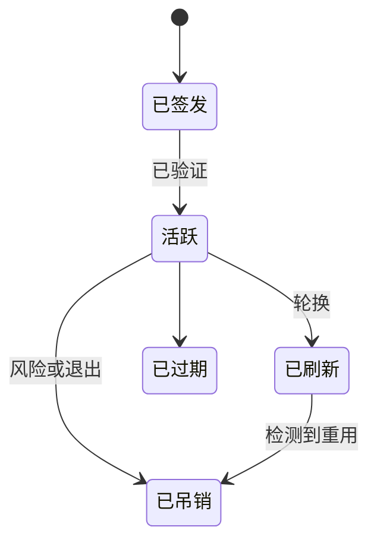

# 04：令牌生命周期与加固

English: [04-token-lifecycle-hardening.md](04-token-lifecycle-hardening.md)

## 5W + How
- **What（什么）：** state、nonce、PKCE、过期、刷新轮换、吊销和发送方约束保护不同阶段。
- **Why（为什么）：** 被盗的有效 Bearer 令牌在过期或吊销前仍可使用。
- **Who（谁）：** 客户端保护浏览器/会话凭据；签发方治理令牌；资源拒绝不安全令牌。
- **When（何时）：** 签发、存储、呈现、刷新、吊销与退出。
- **Where（哪里）：** 加密客户端存储、授权服务器、网关和 API。
- **How（如何）：** 最短生命周期和权限、轮换刷新令牌、绑定受众/资源、检测重用并吊销会话。



```python
def rotate_refresh(record: dict, presented_hash: str) -> str:
    if record["used"] or presented_hash != record["hash"]:
        raise PermissionError("refresh token reuse")
    record["used"] = True
    return "new-one-time-refresh-token"
```

## 故障与面试门槛
覆盖浏览器 XSS、设备失窃、令牌重放、时钟偏差、陈旧会话、签名密钥轮换和紧急吊销。访问或刷新令牌不得进入 URL 或日志。

