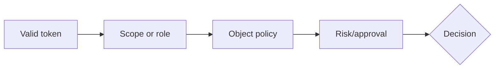

# 05: Permissions, Policy, and HTTP Decisions

Chinese: [05-permissions-policy-http.zh.md](05-permissions-policy-http.zh.md)

## 5W + How
- **What:** scopes describe delegated capability, roles support assigned permissions, and business policy evaluates the object and context.
- **Why:** coarse token permissions cannot encode claim ownership, state, amount, or separation of duties.
- **Who:** identity administrators grant permissions; resource owners define policy; server enforces both.
- **When:** every tool invocation and again immediately before mutation.
- **Where:** MCP/API policy enforcement point, close to domain data.
- **How:** validate identity, map action, check scope/role, tenant/object policy, risk tier, and approval.



```python
def http_decision(authenticated: bool, permitted: bool) -> int:
    if not authenticated:
        return 401
    if not permitted:
        return 403
    return 200
```

Tool-list filtering improves UX but is not authorization. Return `401` for missing/invalid authentication and `403` for valid identity with insufficient permission; include only safe challenge detail.

## Failure And Interview Gate
Test tenant crossing, insecure direct object reference, role/scope confusion, stale policy, approval self-service, and hidden-tool invocation.

