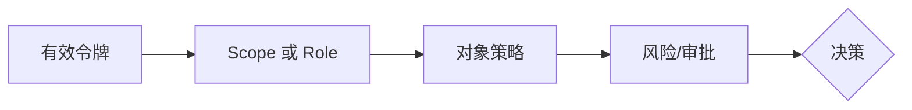

# 05：权限、策略与 HTTP 决策

English: [05-permissions-policy-http.md](05-permissions-policy-http.md)

## 5W + How
- **What（什么）：** scope 表达委托能力，role 表达分配权限，业务策略评估对象与上下文。
- **Why（为什么）：** 粗粒度令牌权限无法表达理赔归属、状态、金额或职责分离。
- **Who（谁）：** 身份管理员授予权限；资源负责人定义策略；服务器同时执行。
- **When（何时）：** 每次工具调用以及变更提交前再次检查。
- **Where（哪里）：** 靠近领域数据的 MCP/API 策略执行点。
- **How（如何）：** 验证身份、映射动作、检查 scope/role、租户/对象策略、风险级别和审批。



```python
def http_decision(authenticated: bool, permitted: bool) -> int:
    if not authenticated:
        return 401
    if not permitted:
        return 403
    return 200
```

隐藏工具只能改善体验，不能代替授权。认证缺失/无效返回 `401`；身份有效但权限不足返回 `403`；挑战信息只能包含安全细节。

## 故障与面试门槛
测试跨租户、对象直接引用、role/scope 混淆、陈旧策略、自我审批和隐藏工具直接调用。

