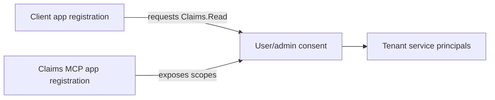

# 06: Microsoft Entra Application Model

Chinese: [06-entra-application-model.zh.md](06-entra-application-model.zh.md)

## 5W + How
- **What:** the third-party MCP client and Claims MCP resource use separate app registrations/service principals.
- **Why:** they have different owners, credentials, audiences, redirect URIs, permissions, and compromise boundaries.
- **Who:** client owner registers the caller; Claims owner exposes the resource and scopes; tenant admin governs consent.
- **When:** before client integration or partner onboarding.
- **Where:** home tenant, resource tenant, and enterprise application/service-principal instances.
- **How:** expose `Claims.Read`/`Claims.Write`, register redirect URIs, request least privilege, consent, and validate the resource audience.



```yaml
claims_mcp_resource:
  identifier_uri: api://claims-mcp
  delegated_scopes: [Claims.Read, Claims.Write]
third_party_client:
  redirect_uris: [https://client.example/callback]
  requested_permissions: [api://claims-mcp/Claims.Read]
```

Do not merge client and resource registrations merely to simplify setup. For partner users, choose and document workforce B2B or External ID tenancy based on ownership and lifecycle requirements.

## Failure And Interview Gate
Explain app object versus service principal, delegated versus application permissions, consent ownership, multitenancy, and why exact redirect/audience configuration matters.

