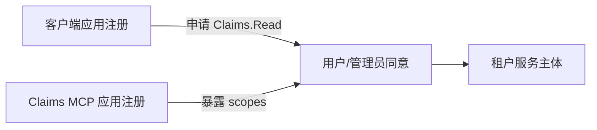

# 06：Microsoft Entra 应用模型

English: [06-entra-application-model.md](06-entra-application-model.md)

## 5W + How
- **What（什么）：** 第三方 MCP 客户端和 Claims MCP 资源使用独立应用注册/服务主体。
- **Why（为什么）：** 两者的负责人、凭据、受众、重定向 URI、权限和失陷边界不同。
- **Who（谁）：** 客户端负责人注册调用方；Claims 负责人暴露资源与 scope；租户管理员治理同意。
- **When（何时）：** 客户端集成或合作方接入之前。
- **Where（哪里）：** 主租户、资源租户及各租户的企业应用/服务主体实例。
- **How（如何）：** 暴露 `Claims.Read`/`Claims.Write`，注册重定向 URI，申请最小权限，同意并验证资源受众。



```yaml
claims_mcp_resource:
  identifier_uri: api://claims-mcp
  delegated_scopes: [Claims.Read, Claims.Write]
third_party_client:
  redirect_uris: [https://client.example/callback]
  requested_permissions: [api://claims-mcp/Claims.Read]
```

不要为了简化配置而合并客户端与资源注册。合作方用户应根据身份归属和生命周期要求，明确选择 workforce B2B 或 External ID 租户模式。

## 故障与面试门槛
说明应用对象与服务主体、委托权限与应用权限、同意责任、多租户，以及精确配置重定向 URI/受众的原因。

