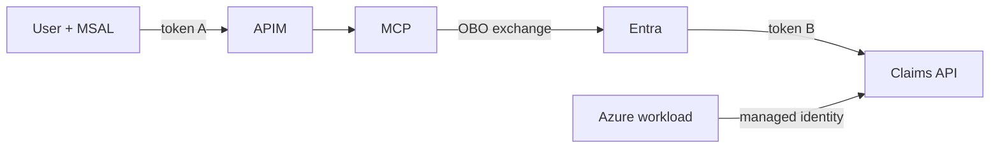

# 07: Azure Identity Patterns

Chinese: [07-azure-identity-patterns.zh.md](07-azure-identity-patterns.zh.md)

## 5W + How
- **What:** MSAL, APIM, managed identity, OBO, sessions, SAML, API keys, and PATs solve different identity problems.
- **Why:** one mechanism cannot safely cover interactive users, downstream delegation, infrastructure, and legacy federation.
- **Who:** clients use MSAL; APIM validates edge tokens; workloads use managed identity; middle tiers use OBO for delegated downstream access.
- **When:** select a pattern per trust boundary and actor type.
- **Where:** client, gateway, Azure workload, and downstream API.
- **How:** keep user delegation separate from app-only automation; exchange tokens for each downstream audience.



```python
def choose_flow(actor: str, downstream_user_context: bool) -> str:
    if actor == "user" and downstream_user_context:
        return "authorization-code-pkce + OBO"
    if actor == "azure-workload":
        return "managed-identity"
    return "client-credentials with explicit app permissions"
```

Session cookies protect a web session, not API delegation. SAML is commonly used for browser federation, while OAuth/OIDC fits modern API access and sign-in. API keys and PATs lack rich user delegation and should be narrowly scoped, rotated, vaulted, and avoided where stronger identity exists.

## Failure And Interview Gate
Never relay an MCP token directly to a different downstream audience. Explain why OBO is delegated, while managed identity/client credentials are app-only.

