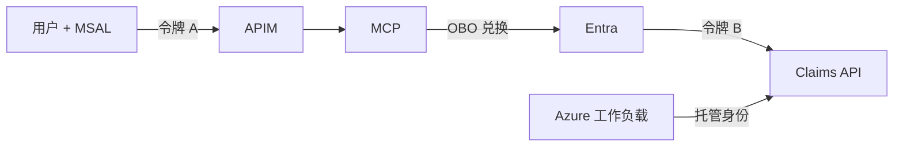

# 07：Azure 身份模式

English: [07-azure-identity-patterns.md](07-azure-identity-patterns.md)

## 5W + How
- **What（什么）：** MSAL、APIM、托管身份、OBO、会话、SAML、API key 和 PAT 解决不同身份问题。
- **Why（为什么）：** 单一机制无法安全覆盖交互用户、下游委托、基础设施和旧式联合身份。
- **Who（谁）：** 客户端用 MSAL；APIM 校验边缘令牌；工作负载用托管身份；中间层用 OBO 代表用户访问下游。
- **When（何时）：** 按每个信任边界和主体类型选型。
- **Where（哪里）：** 客户端、网关、Azure 工作负载和下游 API。
- **How（如何）：** 分离用户委托与 app-only 自动化；为每个下游受众兑换新令牌。



```python
def choose_flow(actor: str, downstream_user_context: bool) -> str:
    if actor == "user" and downstream_user_context:
        return "authorization-code-pkce + OBO"
    if actor == "azure-workload":
        return "managed-identity"
    return "client-credentials with explicit app permissions"
```

会话 Cookie 保护 Web 会话，不提供 API 委托。SAML 常用于浏览器联合身份，OAuth/OIDC 更适合现代 API 与登录。API key/PAT 缺少丰富的用户委托，应最小范围、轮换、入库，并在存在更强身份机制时避免使用。

## 故障与面试门槛
绝不能把 MCP 令牌直接传给不同受众的下游。说明 OBO 属于委托模式，而托管身份/客户端凭据属于 app-only。

