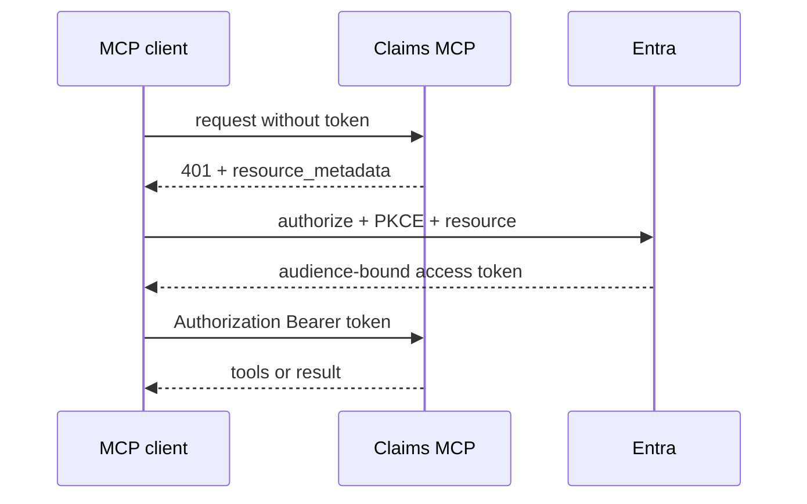

# 08: MCP Authorization and Tool Policy

Chinese: [08-mcp-authorization.zh.md](08-mcp-authorization.zh.md)

## 5W + How
- **What:** protected HTTP MCP servers use OAuth 2.1 discovery, resource indicators, audience-bound tokens, and per-request authorization.
- **Why:** a client must discover the correct authorization server without sending credentials to the wrong resource.
- **Who:** MCP client, protected resource, authorization server, resource owner, and tool policy owner.
- **When:** initialization, tool discovery, and every tool call.
- **Where:** protected-resource metadata, authorization metadata, token endpoint, gateway, and MCP server.
- **How:** return a `401` challenge, discover metadata, authorize with PKCE and `resource`, validate audience, then enforce tool and object policy.



```python
TOOL_POLICY = {
    "claims.read": {"scope": "Claims.Read", "risk": "low"},
    "claims.create": {"scope": "Claims.Write", "risk": "medium"},
    "claims.void": {"scope": "Claims.Void", "risk": "high"},
}
```

Send access tokens only in the Authorization header, never query strings. A tool catalog is capability discovery, not proof of permission. Do not pass the inbound token through to downstream services.

## Failure And Interview Gate
Test metadata spoofing, wrong resource indicator, token passthrough, scope challenge handling, SSRF, tool-description poisoning, and direct invocation of undisclosed tools.

