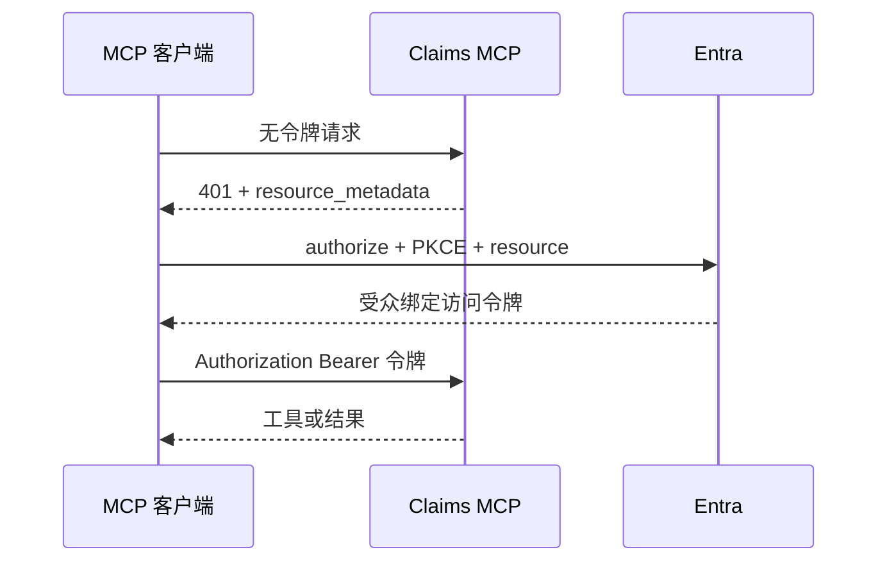

# 08：MCP 授权与工具策略

English: [08-mcp-authorization.md](08-mcp-authorization.md)

## 5W + How
- **What（什么）：** 受保护的 HTTP MCP 服务器使用 OAuth 2.1 发现、resource indicator、受众绑定令牌和逐请求授权。
- **Why（为什么）：** 客户端必须发现正确授权服务器，且不能把凭据发给错误资源。
- **Who（谁）：** MCP 客户端、受保护资源、授权服务器、资源所有者和工具策略负责人。
- **When（何时）：** 初始化、工具发现以及每次工具调用。
- **Where（哪里）：** 受保护资源元数据、授权元数据、令牌端点、网关和 MCP 服务器。
- **How（如何）：** 返回 `401` challenge，发现元数据，携带 PKCE 与 `resource` 授权，验证受众，再执行工具和对象策略。



```python
TOOL_POLICY = {
    "claims.read": {"scope": "Claims.Read", "risk": "low"},
    "claims.create": {"scope": "Claims.Write", "risk": "medium"},
    "claims.void": {"scope": "Claims.Void", "risk": "high"},
}
```

访问令牌只能放在 Authorization header，不能放查询参数。工具目录是能力发现，不是权限证明。不得把入站令牌透传给下游。

## 故障与面试门槛
测试元数据欺骗、错误 resource indicator、令牌透传、scope challenge、SSRF、工具描述投毒和直接调用未展示工具。

