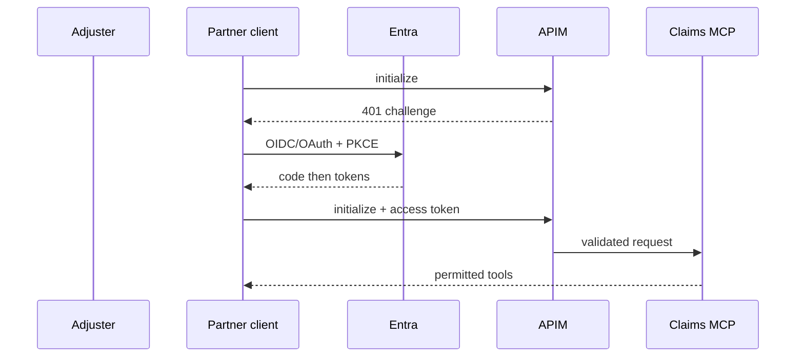

# 09: Claims Login and Protected Discovery

Chinese: [09-claims-login-discovery.zh.md](09-claims-login-discovery.zh.md)

## 5W + How
- **What:** the first complete Claims journey from unauthenticated MCP discovery to an authorized tool catalog.
- **Why:** it proves identity, client/resource registration, consent, audience, gateway, and server controls work together.
- **Who:** claims adjuster, partner client, Entra, APIM, and Claims MCP.
- **When:** first connection, expired session, or step-up permission challenge.
- **Where:** browser, client callback, Entra endpoints, APIM, and MCP endpoint.
- **How:** challenge, metadata discovery, PKCE login, token exchange, token validation, consent-aware tool filtering, and audit.



```python
def visible_tools(granted: set[str]) -> list[str]:
    mapping = {"Claims.Read": "claims.read", "Claims.Write": "claims.create"}
    return [tool for scope, tool in mapping.items() if scope in granted]
```

## Failure And Interview Gate
Trace correlation ID, subject, tenant, client ID, resource, granted scope, policy version, and outcome without retaining secrets. Demonstrate reauthentication and incremental consent safely.

