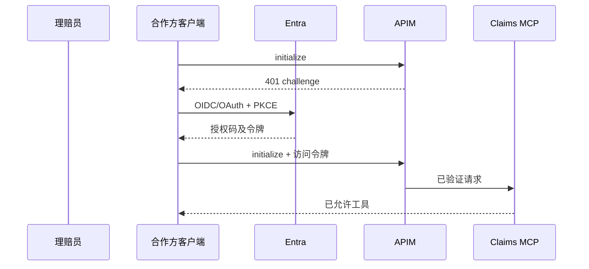

# 09：Claims 登录与受保护发现

English: [09-claims-login-discovery.md](09-claims-login-discovery.md)

## 5W + How
- **What（什么）：** 从未认证 MCP 发现到授权工具目录的第一条完整 Claims 路径。
- **Why（为什么）：** 证明身份、客户端/资源注册、同意、受众、网关和服务器控制能够协作。
- **Who（谁）：** 理赔员、合作方客户端、Entra、APIM 和 Claims MCP。
- **When（何时）：** 首次连接、会话过期或升级权限挑战时。
- **Where（哪里）：** 浏览器、客户端回调、Entra 端点、APIM 与 MCP 端点。
- **How（如何）：** challenge、元数据发现、PKCE 登录、令牌兑换、令牌校验、基于同意的工具筛选与审计。



```python
def visible_tools(granted: set[str]) -> list[str]:
    mapping = {"Claims.Read": "claims.read", "Claims.Write": "claims.create"}
    return [tool for scope, tool in mapping.items() if scope in granted]
```

## 故障与面试门槛
追踪 correlation ID、主体、租户、客户端 ID、资源、已授予 scope、策略版本和结果，但不保留秘密。安全演示重新认证与增量同意。

