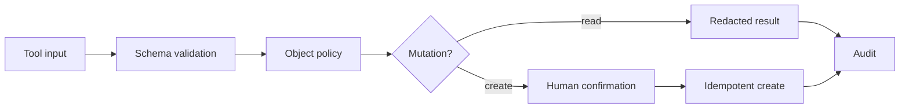

# 10: Read and Create Claims

Chinese: [10-claims-read-create.zh.md](10-claims-read-create.zh.md)

## 5W + How
- **What:** read is object-authorized retrieval; create is a validated, idempotent, human-confirmed mutation.
- **Why:** `Claims.Read` does not grant access to every claim, and model intent alone must not create financial records.
- **Who:** adjuster, AI client, MCP policy layer, approver, and Claims API.
- **When:** after authentication and tool-level permission checks.
- **Where:** schema validation, domain policy, approval UI, transaction boundary, and audit stream.
- **How:** validate input, load authorization context, check tenant/assignment, preview mutation, confirm, execute with idempotency key, and audit.



```python
def create_claim(command: dict, ctx: dict) -> dict:
    assert "Claims.Write" in ctx["scopes"]
    assert command["tenant_id"] == ctx["tenant_id"]
    assert command["confirmed_by"] == ctx["subject"]
    return {"status": "created", "idempotency_key": command["request_id"]}
```

## Failure And Interview Gate
Test cross-tenant IDs, field overposting, duplicate retries, prompt-injected mutations, stale approval, sensitive-field leakage, and enumeration through error messages.

