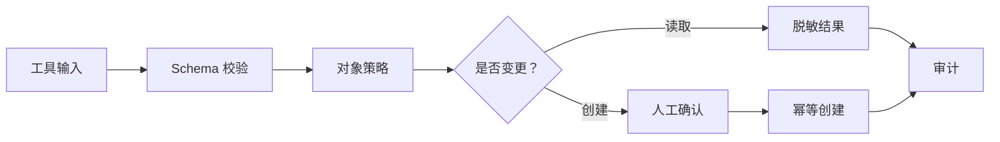

# 10：读取与创建理赔

English: [10-claims-read-create.md](10-claims-read-create.md)

## 5W + How
- **What（什么）：** 读取是对象级授权检索；创建是经过校验、幂等和人工确认的变更。
- **Why（为什么）：** `Claims.Read` 不代表可读全部理赔；模型意图不能直接创建财务记录。
- **Who（谁）：** 理赔员、AI 客户端、MCP 策略层、审批人和 Claims API。
- **When（何时）：** 认证与工具权限检查完成后。
- **Where（哪里）：** Schema 校验、领域策略、审批界面、事务边界和审计流。
- **How（如何）：** 校验输入、加载授权上下文、检查租户/分配、预览变更、确认、用幂等键执行并审计。



```python
def create_claim(command: dict, ctx: dict) -> dict:
    assert "Claims.Write" in ctx["scopes"]
    assert command["tenant_id"] == ctx["tenant_id"]
    assert command["confirmed_by"] == ctx["subject"]
    return {"status": "created", "idempotency_key": command["request_id"]}
```

## 故障与面试门槛
测试跨租户 ID、字段过度提交、重复重试、提示注入触发变更、陈旧审批、敏感字段泄露和错误信息枚举。

