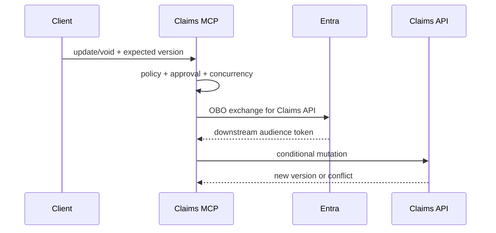

# 11: Update, Void, and Downstream OBO

Chinese: [11-claims-update-void-obo.zh.md](11-claims-update-void-obo.zh.md)

## 5W + How
- **What:** updates use optimistic concurrency; delete becomes governed void/archive; downstream APIs receive a new OBO token.
- **Why:** stale writes lose data, hard delete destroys evidence, and token passthrough violates audience boundaries.
- **Who:** authorized adjuster, independent approver, MCP server, Entra, and Claims API.
- **When:** any existing-record mutation or delegated downstream call.
- **Where:** policy engine, approval service, token exchange, Claims API transaction, and immutable audit store.
- **How:** read current version, validate patch, compare version, require step-up/dual approval by risk, exchange OBO token, soft-delete, and audit before/after hashes.



```python
def conditional_update(current: dict, patch: dict, expected: int) -> dict:
    if current["version"] != expected:
        raise RuntimeError("409 version conflict")
    return {**current, **patch, "version": current["version"] + 1}
```

Void records with reason, actor, approval, retention, and restoration policy. App-only automation uses managed identity or client credentials with explicit application permissions, not OBO.

## Failure And Interview Gate
Test lost updates, approval by the requester, replayed approval, hard-delete bypass, downstream wrong audience, partial failure, and compensation/retry behavior.

