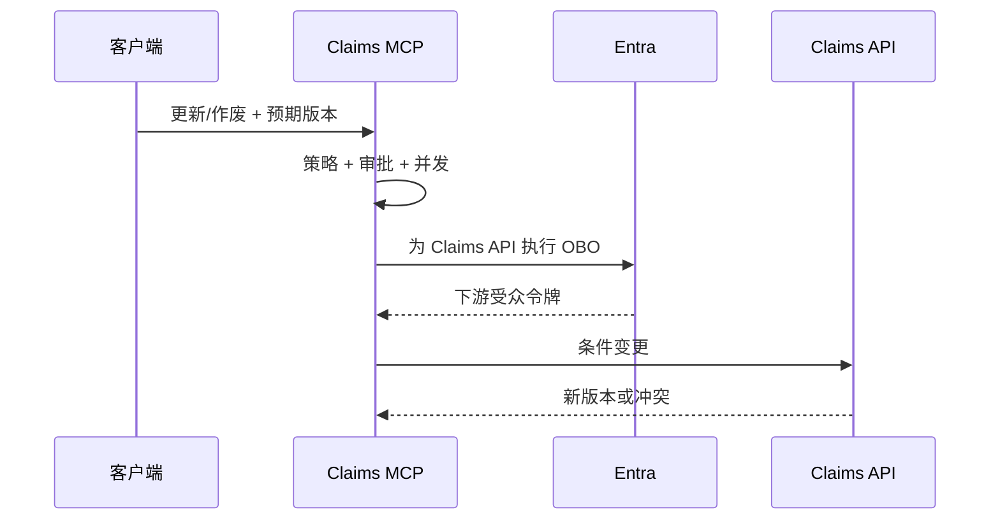

# 11：更新、作废与下游 OBO

English: [11-claims-update-void-obo.md](11-claims-update-void-obo.md)

## 5W + How
- **What（什么）：** 更新使用乐观并发；删除转为受治理的作废/归档；下游 API 获取新的 OBO 令牌。
- **Why（为什么）：** 陈旧写入会丢数据，硬删除破坏证据，令牌透传违反受众边界。
- **Who（谁）：** 获权理赔员、独立审批人、MCP 服务器、Entra 和 Claims API。
- **When（何时）：** 修改既有记录或代表用户调用下游时。
- **Where（哪里）：** 策略引擎、审批服务、令牌兑换、Claims API 事务和不可变审计库。
- **How（如何）：** 读取当前版本、校验 patch、比较版本、按风险要求升级/双人审批、兑换 OBO 令牌、软删除并审计前后哈希。



```python
def conditional_update(current: dict, patch: dict, expected: int) -> dict:
    if current["version"] != expected:
        raise RuntimeError("409 version conflict")
    return {**current, **patch, "version": current["version"] + 1}
```

作废记录必须包含原因、操作者、审批、保留期和恢复策略。app-only 自动化使用托管身份或具有明确应用权限的客户端凭据，不能使用 OBO。

## 故障与面试门槛
测试丢失更新、申请人自批、审批重放、绕过软删除、下游错误受众、部分失败及补偿/重试。

