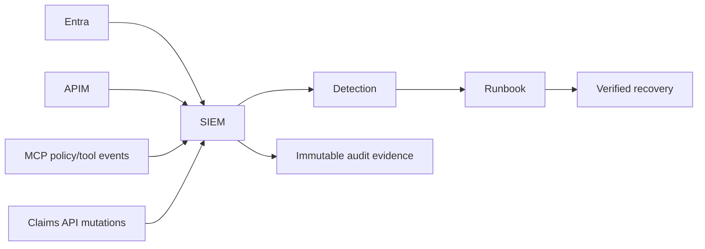

# 12: Audit, Monitoring, and Operations

Chinese: [12-audit-monitoring-operations.zh.md](12-audit-monitoring-operations.zh.md)

## 5W + How
- **What:** correlated security telemetry, immutable audit evidence, alerts, runbooks, evaluations, and release controls.
- **Why:** prevention is incomplete without detection, investigation, recovery, and proof.
- **Who:** platform/SRE, SOC, identity, claims owner, privacy, audit, incident commander, and executives.
- **When:** design time, every request, continuous monitoring, incident response, and release review.
- **Where:** Entra sign-in/audit logs, APIM, MCP traces, policy decisions, Claims API, SIEM, and evidence archive.
- **How:** propagate correlation IDs; record who/what/when/where/why/outcome; redact secrets; alert on anomalies; rehearse revocation and rollback.



```python
def audit_event(ctx: dict, action: str, outcome: str) -> dict:
    return {
        "correlation_id": ctx["correlation_id"], "subject": ctx["subject"],
        "client_id": ctx["client_id"], "tenant_id": ctx["tenant_id"],
        "action": action, "outcome": outcome, "policy_version": ctx["policy_version"],
    }
```

Monitor 401/403 shifts, consent changes, impossible travel, token replay indicators, tool-call spikes, denied high-risk actions, approval anomalies, latency, dependency failure, and audit gaps. Audit data must be access-controlled, retained by policy, and free of raw tokens, secrets, and unnecessary claim content.

## Failure And Interview Gate
Run token-key rotation, compromised client, revoked user, Entra outage, APIM bypass, downstream timeout, audit-pipeline loss, and rollback exercises. Defend residual risk and recovery objectives to a CTO.

