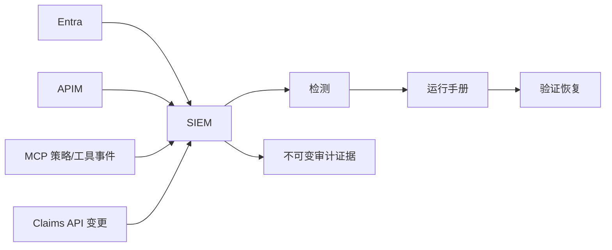

# 12：审计、监控与运维

English: [12-audit-monitoring-operations.md](12-audit-monitoring-operations.md)

## 5W + How
- **What（什么）：** 关联安全遥测、不可变审计证据、告警、运行手册、评估和发布控制。
- **Why（为什么）：** 只有预防，没有检测、调查、恢复和举证并不完整。
- **Who（谁）：** 平台/SRE、SOC、身份、理赔负责人、隐私、审计、事件指挥官和管理层。
- **When（何时）：** 设计、每次请求、持续监控、事件响应和发布评审。
- **Where（哪里）：** Entra 登录/审计日志、APIM、MCP trace、策略决策、Claims API、SIEM 和证据档案。
- **How（如何）：** 传播 correlation ID；记录谁/什么/何时/哪里/为何/结果；脱敏；异常告警；演练吊销和回滚。



```python
def audit_event(ctx: dict, action: str, outcome: str) -> dict:
    return {
        "correlation_id": ctx["correlation_id"], "subject": ctx["subject"],
        "client_id": ctx["client_id"], "tenant_id": ctx["tenant_id"],
        "action": action, "outcome": outcome, "policy_version": ctx["policy_version"],
    }
```

监控 401/403 波动、同意变更、不可能旅行、令牌重放信号、工具调用突增、高风险拒绝、审批异常、延迟、依赖失败与审计缺口。审计数据必须访问受控、按策略保留，且不得包含原始令牌、秘密或非必要理赔内容。

## 故障与面试门槛
演练令牌密钥轮换、客户端失陷、用户吊销、Entra 中断、绕过 APIM、下游超时、审计管道丢失和回滚，并向 CTO 解释剩余风险和恢复目标。

