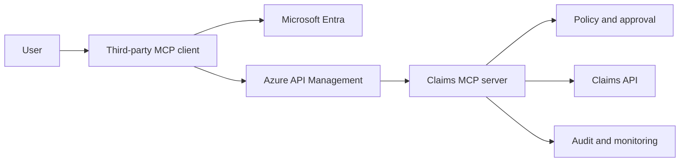

# 15: Microsoft Entra and Claims MCP Security

Chinese: [README.zh.md](README.zh.md) | Capstone: [lab.md](lab.md) | Assessment: [assessment.md](assessment.md)

This specialization reorganizes the identity, OAuth/OIDC, Azure, MCP, and Claims discussions into a buildable enterprise path. Complete courses 8-11 first. The running case is a third-party AI client that reads and changes insurance claims through a protected MCP server.

## 5W + How

- **What:** an end-to-end identity and authorization design for a Claims MCP integration on Microsoft Entra and Azure.
- **Why:** successful login is not proof that a user may invoke a tool or mutate a claim.
- **Who:** client developers, API/MCP teams, identity engineers, security, operations, auditors, architects, and CTOs.
- **When:** before exposing enterprise tools to employees, partners, agents, or unattended workloads.
- **Where:** client, authorization server, gateway, MCP server, policy layer, downstream API, and audit system.
- **How:** authenticate, issue audience-bound tokens, validate, authorize each tool and object, approve risky actions, execute, observe, and audit.



```python
def may_invoke(claims: dict, tool: str) -> bool:
    required = {"claims.read": "Claims.Read", "claims.create": "Claims.Write"}
    return required[tool] in claims.get("scp", "").split()
```

## Learning Path

| Part | Lesson | Build outcome |
|---|---|---|
| I | [01 Identity foundations](01-identity-foundations.md) | Authentication/authorization boundary |
| I | [02 Tokens and validation](02-tokens-and-validation.md) | Correct token consumers and checks |
| I | [03 Authorization Code + PKCE](03-authorization-code-pkce.md) | Secure interactive sign-in |
| II | [04 Token lifecycle and hardening](04-token-lifecycle-hardening.md) | Replay and refresh controls |
| II | [05 Permissions and HTTP decisions](05-permissions-policy-http.md) | Scope, role, policy, 401/403 matrix |
| II | [06 Entra application model](06-entra-application-model.md) | Separate client and resource registrations |
| III | [07 Azure identity patterns](07-azure-identity-patterns.md) | APIM, MSAL, managed identity, OBO |
| III | [08 MCP authorization](08-mcp-authorization.md) | OAuth 2.1 discovery and tool policy |
| IV | [09 Claims login and discovery](09-claims-login-discovery.md) | End-to-end protected discovery |
| IV | [10 Read and create claims](10-claims-read-create.md) | Object checks and human confirmation |
| IV | [11 Update, void, and downstream access](11-claims-update-void-obo.md) | Concurrency, elevated approval, OBO |
| V | [12 Audit, monitoring, and operations](12-audit-monitoring-operations.md) | Evidence, alerts, runbooks, release gate |

## Completion Gate

Pass the capstone and assessment at 80%, with no critical token-validation, authorization, destructive-action, or audit finding. Examples are production-shaped teaching assets; deployment still requires organization-specific threat modeling, legal review, tenant configuration, penetration testing, and operational approval.

## Primary Standards

- [Microsoft identity platform authorization code flow](https://learn.microsoft.com/en-us/entra/identity-platform/v2-oauth2-auth-code-flow)
- [Microsoft Entra application registration](https://learn.microsoft.com/en-us/entra/identity-platform/quickstart-register-app)
- [Microsoft identity platform On-Behalf-Of flow](https://learn.microsoft.com/en-us/entra/identity-platform/v2-oauth2-on-behalf-of-flow)
- [MCP Authorization specification (2025-11-25)](https://modelcontextprotocol.io/specification/2025-11-25/basic/authorization)

