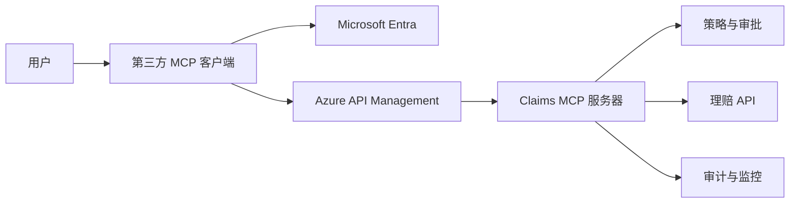

# 15：Microsoft Entra 与 Claims MCP 安全

English: [README.md](README.md) | 综合实验：[lab.zh.md](lab.zh.md) | 考核：[assessment.zh.md](assessment.zh.md)

本专项课把身份、OAuth/OIDC、Azure、MCP 与理赔案例的讨论重组为可实施的企业学习路径。建议先完成第 8-11 课。贯穿案例是第三方 AI 客户端通过受保护的 MCP 服务器读取和变更保险理赔。

## 5W + How

- **What（什么）：** 基于 Microsoft Entra 与 Azure 的 Claims MCP 端到端身份和授权设计。
- **Why（为什么）：** 登录成功不代表用户有权调用工具或修改理赔。
- **Who（谁）：** 客户端、API/MCP、身份、安全、运维、审计、架构师与 CTO。
- **When（何时）：** 向员工、合作方、Agent 或无人值守工作负载开放企业工具之前。
- **Where（哪里）：** 客户端、授权服务器、网关、MCP、策略层、下游 API 与审计系统。
- **How（如何）：** 认证、签发受众绑定令牌、验证、逐工具和逐对象授权、高风险审批、执行、观测与审计。



```python
def may_invoke(claims: dict, tool: str) -> bool:
    required = {"claims.read": "Claims.Read", "claims.create": "Claims.Write"}
    return required[tool] in claims.get("scp", "").split()
```

## 学习路径

| 部分 | 课程 | 构建成果 |
|---|---|---|
| I | [01 身份基础](01-identity-foundations.zh.md) | 认证与授权边界 |
| I | [02 令牌与验证](02-tokens-and-validation.zh.md) | 正确的令牌使用方与校验 |
| I | [03 授权码 + PKCE](03-authorization-code-pkce.zh.md) | 安全交互式登录 |
| II | [04 令牌生命周期与加固](04-token-lifecycle-hardening.zh.md) | 重放和刷新控制 |
| II | [05 权限策略与 HTTP 决策](05-permissions-policy-http.zh.md) | scope、role、策略和 401/403 矩阵 |
| II | [06 Entra 应用模型](06-entra-application-model.zh.md) | 分离客户端与资源注册 |
| III | [07 Azure 身份模式](07-azure-identity-patterns.zh.md) | APIM、MSAL、托管身份、OBO |
| III | [08 MCP 授权](08-mcp-authorization.zh.md) | OAuth 2.1 发现与工具策略 |
| IV | [09 Claims 登录与发现](09-claims-login-discovery.zh.md) | 端到端受保护发现 |
| IV | [10 读取与创建理赔](10-claims-read-create.zh.md) | 对象校验与人工确认 |
| IV | [11 更新、作废与下游访问](11-claims-update-void-obo.zh.md) | 并发、升级审批、OBO |
| V | [12 审计、监控与运维](12-audit-monitoring-operations.zh.md) | 证据、告警、手册与发布门禁 |

## 完成门槛

综合实验和考核达到 80%，且令牌验证、授权、破坏性操作和审计不得存在严重问题。示例具有生产形态，但上线仍需组织级威胁建模、法务审查、租户配置、渗透测试与运维审批。

## 主要标准

- [Microsoft 身份平台授权码流程](https://learn.microsoft.com/zh-cn/entra/identity-platform/v2-oauth2-auth-code-flow)
- [Microsoft Entra 应用注册](https://learn.microsoft.com/zh-cn/entra/identity-platform/quickstart-register-app)
- [Microsoft 身份平台代表流（OBO）](https://learn.microsoft.com/zh-cn/entra/identity-platform/v2-oauth2-on-behalf-of-flow)
- [MCP 授权规范（2025-11-25）](https://modelcontextprotocol.io/specification/2025-11-25/basic/authorization)

