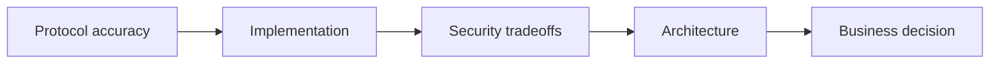

# Assessment and Interview Defense

Chinese: [assessment.zh.md](assessment.zh.md) | Course: [README.md](README.md)

## Progressive Interview Ladder

| Level | You must defend |
|---|---|
| Beginner | Authentication vs authorization; OAuth vs OIDC; ID vs access token; 401 vs 403 |
| Engineer | Authorization Code + PKCE; state/nonce; token validation; sessions and refresh lifecycle |
| Senior | Entra app/service-principal model; scope/role/object policy; APIM and server defense in depth |
| Staff | MCP OAuth discovery; tool authorization; OBO; app-only identity; multi-tenant consent |
| Architect | Claims CRUD risk controls, concurrency, approvals, audit evidence, failure recovery |
| CTO | Build/buy choices, regulatory exposure, operating cost, ownership, residual risk, rollout gates |



## Scenario Questions

1. Why can an API reject a token that was validly signed by Entra?
2. Why are the third-party client and Claims MCP separate app registrations?
3. Which artifact belongs to the client session, and which belongs at the resource server?
4. What do `state`, `nonce`, and PKCE each prevent?
5. When should the server return `401`, `403`, and `409`?
6. Why is hiding `claims.void` from the tool list insufficient?
7. Why must the Claims MCP exchange rather than pass through its inbound token?
8. When is OBO wrong, and managed identity or client credentials correct?
9. How do human confirmation, independent approval, idempotency, and optimistic concurrency differ?
10. What evidence proves who changed a claim without leaking claim data or tokens?
11. How does the system behave during Entra, APIM, Claims API, or audit-pipeline failure?
12. What would make you delay production launch even after the POC passes?

```python
def passed(score: int, critical_findings: int) -> bool:
    return score >= 80 and critical_findings == 0
```

## Scoring

Score protocol correctness 20, implementation 20, security reasoning 25, operations 15, and executive tradeoffs 20. Answers must name assumptions, rejected alternatives, evidence, and residual risk; memorized definitions alone cannot pass senior level.

