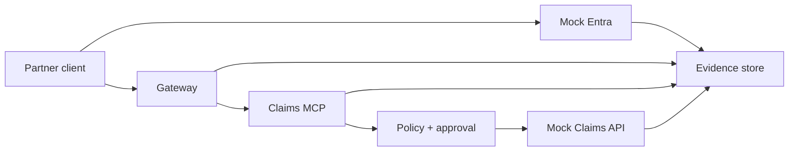

# Capstone: Enterprise Claims MCP Security

Chinese: [lab.zh.md](lab.zh.md) | Course: [README.md](README.md)

## Mission

Design and test a production-shaped, non-production Claims MCP proof of concept for a partner adjuster. Use synthetic claims and mock tokens only.



## Deliverables

1. Register separate client, Claims MCP resource, and downstream API identities. Document owners, tenants, redirect URIs, audiences, scopes/roles, consent, credentials, and rotation.
2. Implement a simulated Authorization Code + PKCE flow with `state`, `nonce`, exact redirect matching, resource/audience binding, and JWKS/key-rotation tests.
3. Implement MCP protected-resource discovery and `401`/`403` behavior. Never accept tokens in query strings or pass inbound tokens downstream.
4. Define typed `claims.read`, `claims.create`, `claims.update`, and `claims.void` tools with strict schemas and risk tiers.
5. Enforce tenant/object policy on every operation. Add human confirmation for create/update and independent elevated approval for void.
6. Add idempotency for create, optimistic concurrency for update, soft delete for void, and a mocked OBO exchange for delegated downstream calls.
7. Emit correlated, redacted audit events and build alerts for replay, cross-tenant denial, approval anomalies, and audit-pipeline failure.
8. Produce a threat model, data-flow diagram, runbook, rollback plan, residual-risk register, and executive decision memo.

```python
TEST_MATRIX = {
    "wrong_audience": 401,
    "missing_scope": 403,
    "cross_tenant_claim": 403,
    "stale_version": 409,
    "replayed_create": 200,
    "unapproved_void": 403,
}
```

## Acceptance Gate

- **Identity and protocol (20):** correct artifact consumers, PKCE, discovery, issuer/audience/time/key checks.
- **Authorization (25):** least privilege, tenant/object policy, risk tiers, approval separation.
- **Data integrity (15):** strict schema, idempotency, concurrency, soft delete, compensation.
- **Operations (20):** useful telemetry, immutable evidence, alerts, incident and recovery exercises.
- **Architecture defense (20):** explicit trust boundaries, alternatives, costs, residual risks, and CTO recommendation.

Pass at 80/100 with no critical finding. A mocked success does not authorize production deployment.

