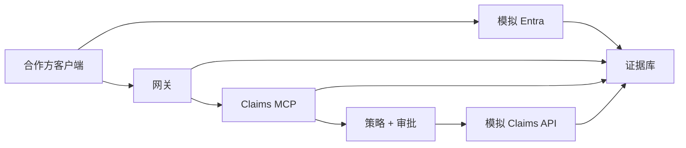

# 综合实验：企业 Claims MCP 安全

English: [lab.md](lab.md) | 课程：[README.zh.md](README.zh.md)

## 任务

为合作方理赔员设计并测试具有生产形态、但不用于生产的 Claims MCP POC。只使用合成理赔和模拟令牌。



## 交付物

1. 分别注册客户端、Claims MCP 资源和下游 API 身份，记录负责人、租户、重定向 URI、受众、scope/role、同意、凭据与轮换。
2. 实现模拟授权码 + PKCE，包含 `state`、`nonce`、精确重定向匹配、资源/受众绑定，以及 JWKS/密钥轮换测试。
3. 实现 MCP 受保护资源发现与 `401`/`403`；禁止查询参数令牌和下游令牌透传。
4. 定义严格 Schema 和风险等级的 `claims.read`、`claims.create`、`claims.update`、`claims.void` 工具。
5. 每项操作执行租户/对象策略；创建/更新需人工确认；作废需独立升级审批。
6. 创建支持幂等，更新支持乐观并发，作废使用软删除，委托下游调用使用模拟 OBO 兑换。
7. 发出关联且脱敏的审计事件，并为重放、跨租户拒绝、审批异常和审计管道失败建立告警。
8. 产出威胁模型、数据流图、运行手册、回滚计划、剩余风险登记表和管理层决策备忘录。

```python
TEST_MATRIX = {
    "wrong_audience": 401,
    "missing_scope": 403,
    "cross_tenant_claim": 403,
    "stale_version": 409,
    "replayed_create": 200,
    "unapproved_void": 403,
}
```

## 验收门槛

- **身份与协议（20）：** 正确凭据使用方、PKCE、发现、签发者/受众/时间/密钥校验。
- **授权（25）：** 最小权限、租户/对象策略、风险分级、审批分离。
- **数据完整性（15）：** 严格 Schema、幂等、并发、软删除、补偿。
- **运维（20）：** 有效遥测、不可变证据、告警、事件与恢复演练。
- **架构答辩（20）：** 明确信任边界、替代方案、成本、剩余风险和 CTO 建议。

80/100 及格且不得有严重问题。模拟成功不代表获准生产上线。

