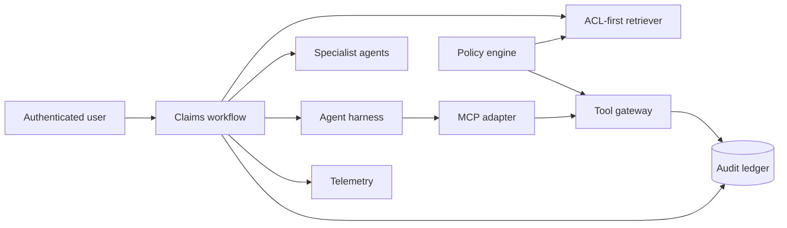

# XingAI Enterprise AI Reference POC

Chinese: [README.zh.md](README.zh.md)

This is a production-shaped teaching implementation for the [Deep Enterprise AI track](../deep-enterprise-ai/README.md). It is not a production deployment or compliance certification. The design minimizes the changes needed for enterprise adoption by keeping domain contracts, authorization, audit, orchestration, retrieval, tools, and framework adapters separate.

## 5W + How

- **What:** a governed claims knowledge and decision workflow demonstrating enterprise RAG, bounded agents, MCP-style tools, authorization, observability, and audit.
- **Why:** learners need one coherent implementation where quality, authority, state, and operations interact.
- **Who:** application/platform engineers, AI architects, security reviewers, SREs, engineering leaders, and CTOs.
- **When:** use as a reference, interview portfolio, architecture spike, or starting point for an authorized enterprise pilot.
- **Where:** the core sits between authenticated product surfaces and company data/tools; execution is separately approved.
- **How:** install locally, run tests, replace adapters deliberately, then complete the production-readiness checklist.

## Architecture



## Run

```bash
cd enterprise-poc
python3 -m venv .venv
.venv/bin/pip install -e .
.venv/bin/python -m unittest discover -s tests -v
```

The core has no runtime dependency outside Python 3.11. Framework adapters, remote MCP transport, databases, OIDC verification, OpenTelemetry exporters, and deployment infrastructure are intentional extension boundaries.

## Modules

- `auth.py`: deny-by-default tenant, scope, and role policy.
- `identity.py`: approved signature-verifier port plus issuer/audience/expiry claim checks.
- `rag.py`: authorization before ranking and evidence provenance.
- `harness.py`: bounded steps, tool calls, deadlines, and normalized results.
- `loops.py`: legal workflow states and transitions.
- `agents.py`: specialist findings and explicit consensus.
- `mcp.py`: MCP-shaped tool discovery and call adapter.
- `tools.py`: policy, approval, side-effect, and audit gateway.
- `observability.py`: metrics, structured logging, and trace spans.
- `audit.py`: append-only hash-chain teaching ledger.
- `evaluation.py`: deterministic dataset runner and release decision.
- `workflow.py`: deterministic business orchestration.
- `service.py`: persistent health/readiness process for container probes.

## Enterprise Replacement Map

| Reference component | Enterprise replacement |
|---|---|
| In-memory documents | Object storage + ingestion pipeline + PostgreSQL/pgvector |
| Lexical scorer | Hybrid search + reranker + evaluation-gated adapter |
| Local policy engine | OPA/Cedar/company policy service |
| Actor dataclass | Verified OIDC/workload identity claims |
| MCP adapter | Official MCP SDK transport and authorization |
| In-memory telemetry | OpenTelemetry collector and approved backends |
| Hash-chain ledger | Durable append-only/WORM audit storage |
| Synchronous workflow | Durable queue/workflow runtime with idempotency |

## Production Gate

Do not call the system production-ready until identity, tenant isolation, encryption, secrets, deletion, backups, recovery, load, red-team, domain evaluation, legal/privacy review, accessibility, operational ownership, incident response, and change-management evidence pass the target company’s controls.
