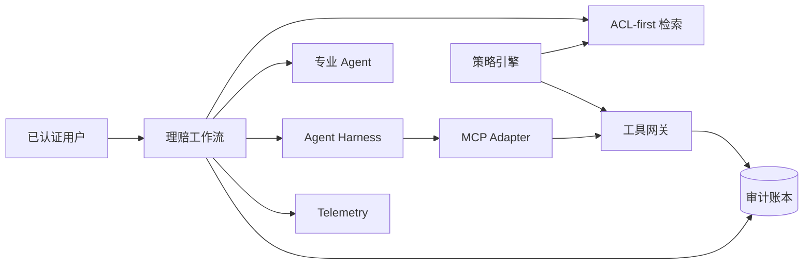

# XingAI 企业 AI 参考 POC

English: [README.md](README.md)

这是[企业 AI 深度课程](../deep-enterprise-ai/README.zh.md)配套的 Production-shaped 教学实现，不代表生产部署或合规认证。它通过分离领域契约、授权、审计、编排、检索、工具和 Framework Adapter，减少企业落地时的结构性修改。

## 5W + How

- **What：** 一个受治理的理赔知识与决策工作流，展示企业 RAG、受限 Agent、MCP 风格工具、授权、可观测性和审计。
- **Why：** 学习者需要看到质量、权限、状态和运营如何在一个完整实现中交互。
- **Who：** 应用/平台工程师、AI 架构师、安全评审者、SRE、工程领导者与 CTO。
- **When：** 作为参考实现、面试作品集、架构 Spike 或已授权企业 Pilot 的起点。
- **Where：** Core 位于已认证产品界面与企业数据/工具之间；执行需要单独审批。
- **How：** 本地安装并运行测试，有意识地替换 Adapter，再完成生产就绪检查。

## 架构



## 运行

```bash
cd enterprise-poc
python3 -m venv .venv
.venv/bin/pip install -e .
.venv/bin/python -m unittest discover -s tests -v
```

Core 除 Python 3.11 外没有运行时依赖。Agent Framework Adapter、远程 MCP Transport、数据库、OIDC 校验、OpenTelemetry Exporter 与部署基础设施是有意保留的扩展边界。

## 模块

- `auth.py`：默认拒绝的 Tenant、Scope 与 Role 策略。
- `identity.py`：批准的 Signature Verifier Port 与 Issuer/Audience/Expiry Claims 校验。
- `rag.py`：排序前授权和 Evidence Provenance。
- `harness.py`：步骤、工具次数、Deadline 与规范化结果。
- `loops.py`：合法工作流状态和转换。
- `agents.py`：专业 Agent 发现与显式 Consensus。
- `mcp.py`：MCP 风格工具发现与调用 Adapter。
- `tools.py`：策略、审批、副作用与审计网关。
- `observability.py`：指标、结构化日志与 Trace Span。
- `audit.py`：Append-only Hash Chain 教学账本。
- `evaluation.py`：确定性 Dataset Runner 与发布判断。
- `workflow.py`：确定性业务编排。
- `service.py`：用于 Container Probe 的持久 Health/Readiness 进程。

## 企业替换映射

| 参考组件 | 企业替换项 |
|---|---|
| 内存文档 | 对象存储 + 摄取 Pipeline + PostgreSQL/pgvector |
| 关键词评分 | 混合搜索 + Reranker + 评估门禁 Adapter |
| 本地策略引擎 | OPA/Cedar/企业策略服务 |
| Actor Dataclass | 已验证 OIDC/Workload Identity Claims |
| MCP Adapter | 官方 MCP SDK Transport 与授权 |
| 内存 Telemetry | OpenTelemetry Collector 与批准的 Backend |
| Hash-chain Ledger | Durable Append-only/WORM 审计存储 |
| 同步工作流 | 带幂等的 Durable Queue/Workflow Runtime |

## 生产门槛

身份、Tenant 隔离、加密、密钥、删除、备份、恢复、负载、红队、领域评估、法务/隐私评审、可访问性、运营责任、事故响应与变更管理证据通过目标企业控制前，不得称为生产就绪。
