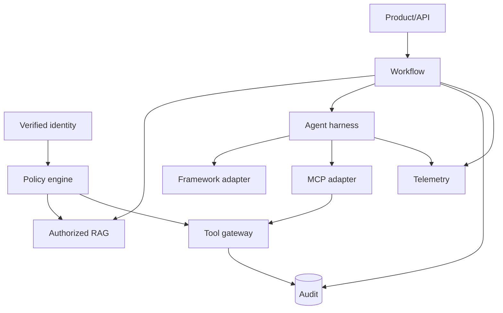

# Reference Architecture

Chinese: [architecture.zh.md](architecture.zh.md)

## Responsibility Map

| Component | Owns | Must not own |
|---|---|---|
| Identity adapter | Cryptographically verified claims mapping | Business authorization |
| Policy engine | Tenant/action/resource/context authorization | Model reasoning |
| Retriever | Authorized evidence and provenance | Final recommendation |
| Agent harness | Context, budgets, tools, stop, telemetry | Business workflow order |
| Agent framework adapter | Framework execution details | Domain schemas and policy |
| MCP adapter | Protocol discovery/calls | Orchestration and decision logic |
| Workflow | State, sequencing, recommendation assembly | Identity cryptography |
| Tool gateway | Side-effect boundary and approval enforcement | Approval decision itself |
| Telemetry | Operational evidence | Compliance audit record |
| Audit ledger | Accountable immutable events | Debug payload dumping |

The in-memory implementation is a structural reference. Enterprise adapters must preserve these ownership boundaries and pass the same contracts.

