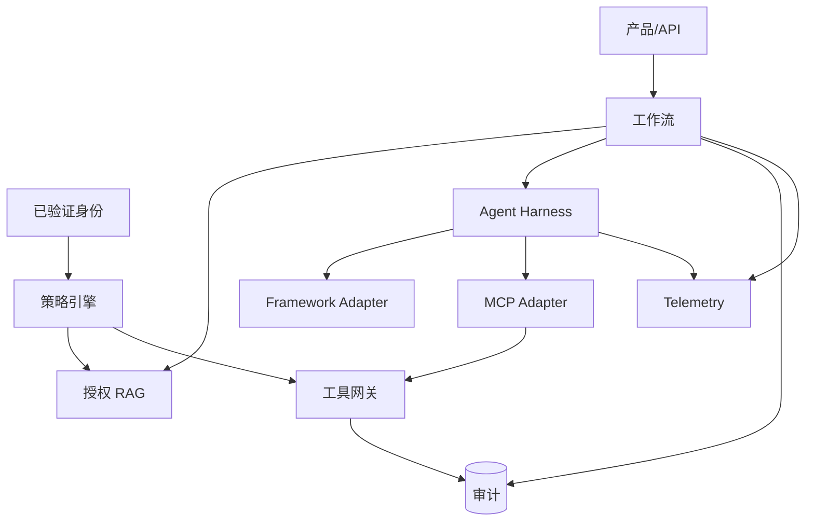

# 参考架构

English: [architecture.md](architecture.md)

## 职责映射

| 组件 | 负责 | 不得负责 |
|---|---|---|
| Identity Adapter | 加密校验后 Claims 映射 | 业务授权 |
| Policy Engine | Tenant/Action/Resource/Context 授权 | 模型推理 |
| Retriever | 已授权证据与 Provenance | 最终建议 |
| Agent Harness | Context、预算、工具、停止、Telemetry | 业务流程顺序 |
| Agent Framework Adapter | Framework 执行细节 | 领域 Schema 与策略 |
| MCP Adapter | 协议发现/调用 | 编排与决策逻辑 |
| Workflow | 状态、顺序、建议组装 | 身份加密 |
| Tool Gateway | 副作用边界与审批执行 | 审批决策本身 |
| Telemetry | 运营证据 | 合规审计记录 |
| Audit Ledger | 可问责不可变事件 | Debug Payload Dump |

内存实现是结构参考。企业 Adapter 必须保留这些所有权边界，并通过相同契约。

